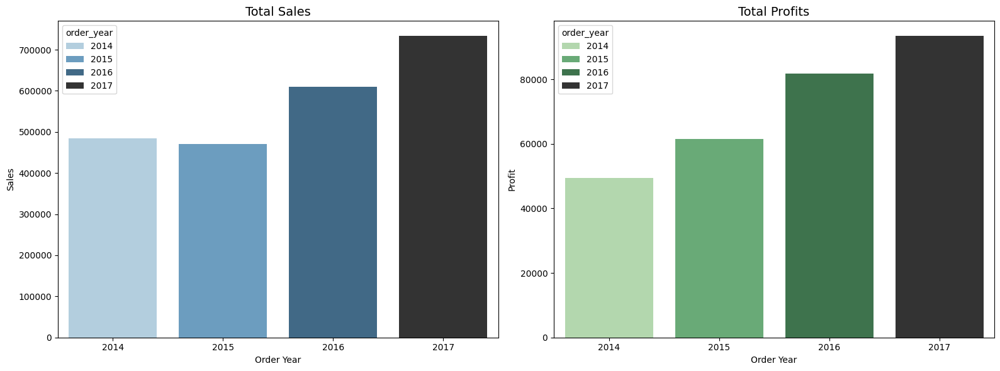
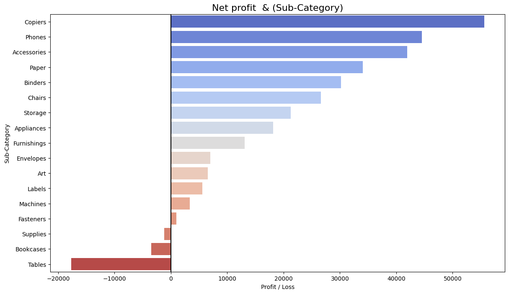
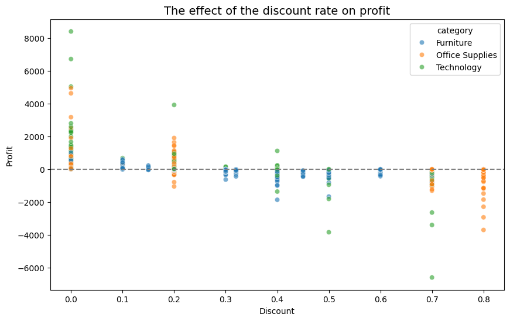

# 📊 Superstore Sales & Profit Analysis

مشروع تحليل بيانات شامل لمتجر **Superstore** باستخدام لغة Python والمكتبات الإحصائية والرسومية (`Pandas`, `Matplotlib`, `Seaborn`). يهدف المشروع إلى استكشاف الأنماط التجارية، تتبع أداء المبيعات والأرباح عبر السنوات، وتحليل كفاءة التوصيل وتأثير الخصومات على هامش الربح.

---

## 📑 فهرس المحتويات
- [عن المشروع](#-عن-المشروع)
- [مجموعة البيانات](#-مجموعة-البيانات)
- [خطوات العمل والمعالجة](#-خطوات-العمل-والمعالجة)
- [معرض التحليلات والرسوم البيانية](#-معرض-التحليلات-والرسوم-البيانية)
- [أبرز النتائج](#-أبرز-النتائج)
- [المتطلبات وطريقة التشغيل](#-المتطلبات-وطريقة-التشغيل)

---

## ℹ️ عن المشروع
يقدم هذا المشروع تحليلاً استكشافياً للبيانات (EDA) لمساعدة إدارة متجر Superstore على فهم عوامل النمو وتحديد المناطق والمنتجات الأكثر ربحية، بالإضافة إلى كشف المنتجات والمناطق التي تتسبب في خسائر مالية بسبب سياسات الخصم أو تأخر التوصيل.

---

## 📦 مجموعة البيانات
تم تحميل مجموعة البيانات تلقائياً باستخدام **KaggleHub**:
* **المصدر:** `vivek468/superstore-dataset-final`
* **عدد السجلات:** 9,994 طلب شحن.
* **أبرز الأعمدة:**
  * `Order Date` & `Ship Date`: تواريخ الطلب والشحن.
  * `Sales`, `Profit`, `Quantity`, `Discount`: الأرقام المالية للطلبات.
  * `Category` & `Sub-Category`: تصنيفات المنتجات.
  * `Region`, `State`, `City`: البيانات الجغرافية.
  * `Segment` & `Ship Mode`: فئات العملاء ووسائل الشحن.

---

## 🛠️ خطوات العمل والمعالجة

1. **تحميل البيانات:** استخدام مكتبة `kagglehub` لتنزيل وقراءة البيانات مباشرة في `Pandas DataFrame`.
2. **تنظيف وتجهيز البيانات (Data Cleaning & Preprocessing):**
   * توحيد أسماء الأعمدة وتنظيفها.
   * تحويل أعمدة التواريخ إلى صيغة `datetime`.
   * **إضافة ميزات مشتقة (Feature Engineering):**
     * `order_year` / `order_month`: لاستكشاف التوجهات الزمنية.
     * `delivery_days`: حساب مدة التوصيل بالأيام (`ship_date` - `order_date`).
     * `profit_margin`: نسبة هامش الربح `(profit / sales) * 100`.

---

## 🖼️ معرض التحليلات والرسوم البيانية

### 1. اتجاه المبيعات والأرباح السنوية (Sales & Profit Trends)


### 2. أداء التصنيفات والمنتجات (Category & Sub-Category Performance)


### 3. تأثير الخصم على هامش الربح (Discount vs Profit Margin)


---

## 📈 أبرز النتائج

| محور التحليل | ملخص النتيجة |
| :--- | :--- |
| **الأداء السنوي** | نمو متزايد في إجمالي المبيعات والأرباح سنوياً مع الحفاظ على هامش ربح إيجابي. |
| **المناطق الجغرافية** | تباين في الأداء بين المناطق بسبب اختلاف حجم المبيعات ونسب الخصم الممنوحة. |
| **أداء المنتجات** | قطاع التكنولوجيا (Technology) يحقق أعلى ربحية، بينما تعاني بعض منتجات الأثاث (Furniture) من خسائر. |
| **سلاسل الإمداد** | تم حساب متوسط أيام التوصيل (`delivery_days`) وتقييم مدى التزام وسائل الشحن المختلفة (`Ship Mode`). |

---

## 🚀 المتطلبات وطريقة التشغيل

### المتطلبات الأساسية
* Python 3.8+
* Jupyter Notebook أو Google Colab

### الحزم المطلوبة (Dependencies)
```bash
pip install pandas matplotlib seaborn kagglehub